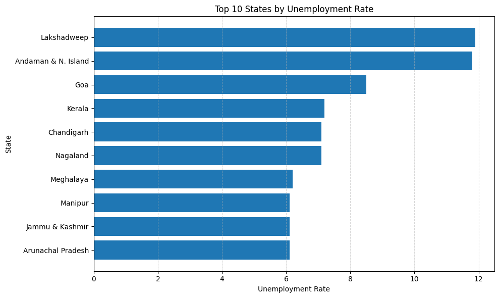
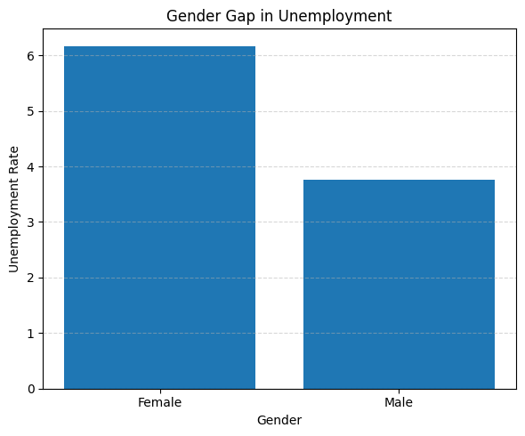
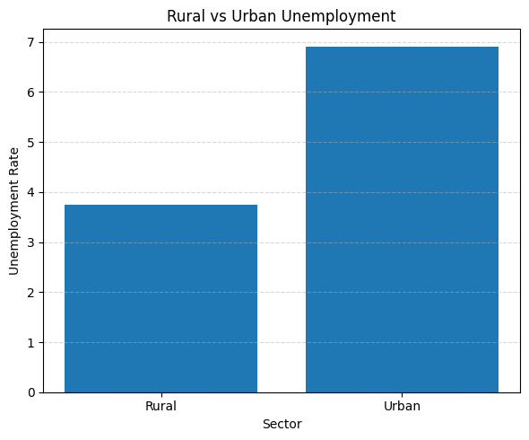
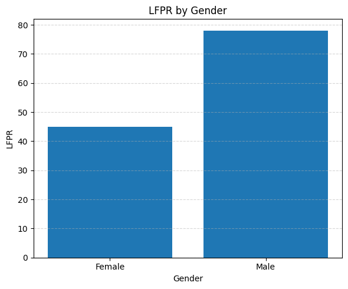
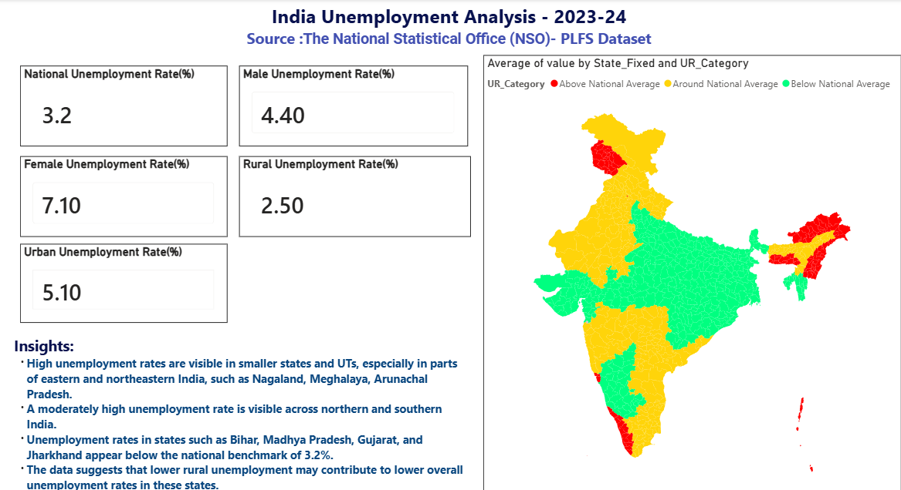
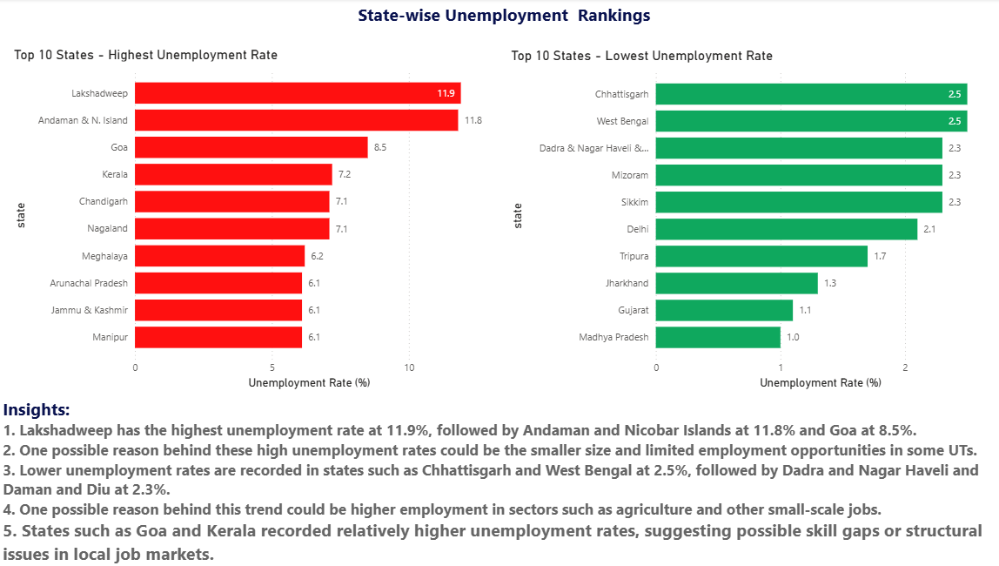
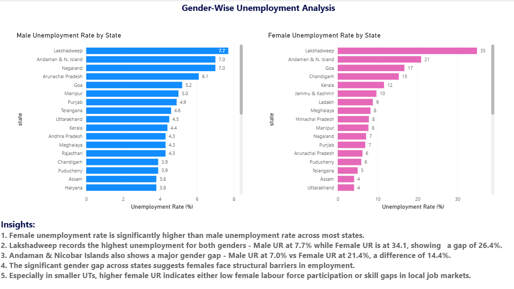
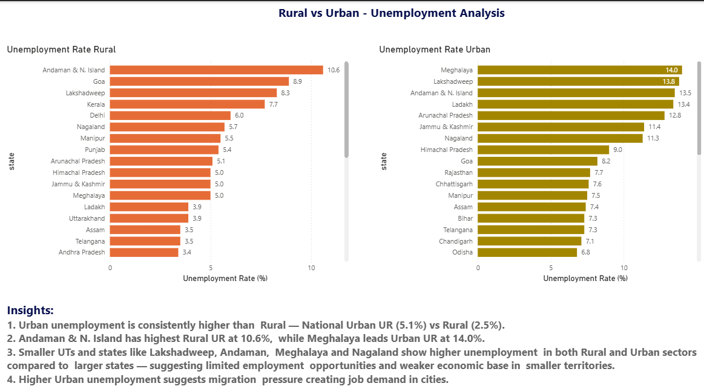
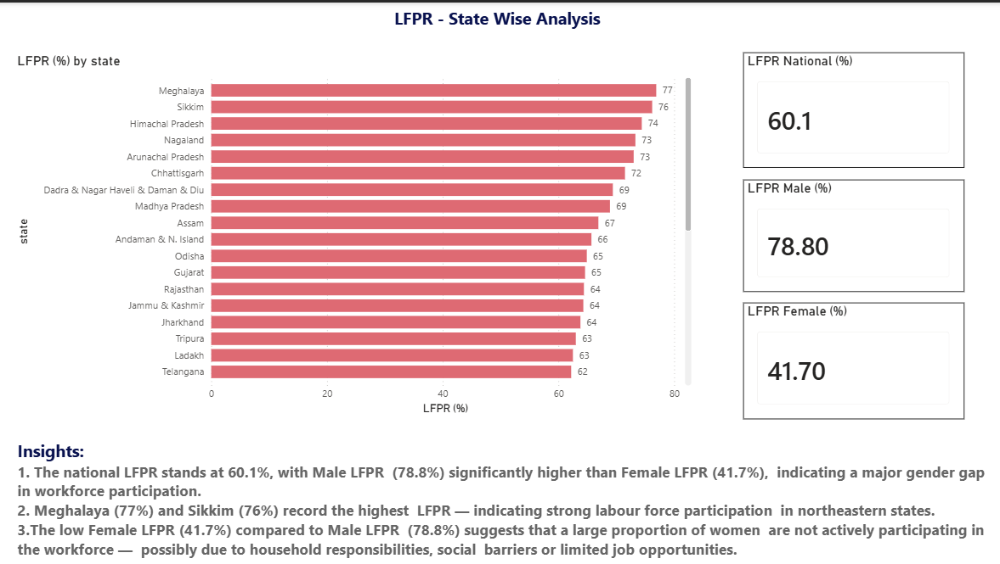
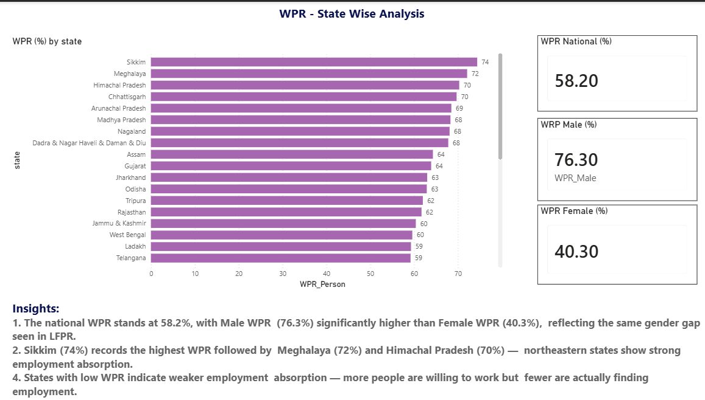

# Unemployment Analysis in India | PLFS 2023-24

A data analysis project exploring unemployment trends in India using the Periodic Labour Force Survey (PLFS) 2023-24 dataset.
The analysis focuses on Unemployment Rate across States/UTs, Gender Gap, Worker Population Ratio (WPR), and Labour Force 
Participation Rate (LFPR).

---

## About the Project

This project focuses on understanding the unemployment trends in India for the year 2023-24 using the Periodic Labour Force 
Survey (PLFS) dataset published by the National Statistical Office (NSO) under the Ministry of Statistics and Programme 
Implementation (MoSPI), Government of India.

The analysis covers the following key labour market indicators:

- **Unemployment Rate (UR)** — measures the proportion of people actively seeking work but unable to find employment
- **Labour Force Participation Rate (LFPR)** — measures the proportion of population actively participating in the workforce
- **Worker Population Ratio (WPR)** — measures the proportion of employed persons in the total population

### Coverage

| Field | Details |
|-------|---------|
| Survey Year | 2023-24 |
| Age Group | 15 to 59 years |
| States/UTs | 36 States and UTs |
| Sectors | Rural, Urban, Rural+Urban |
| Gender | Male, Female, Person (combined) |


### Key Questions Answered
1. Which states have the highest and lowest unemployment?
2. How does unemployment differ between Male and Female?
3. Is Urban unemployment higher than Rural unemployment?
4. Which states are above and below the national benchmark?
5. How does LFPR and WPR vary across states?
6. Do smaller UTs face higher unemployment than larger states?

--- 

## Key Findings

### 1. State-wise Unemployment


- The overall unemployment rate in India stands at **3.2%** (Rural+Urban, Person) for the age group 15-59 years as 
per PLFS 2023-24.
- Highest unemployment is recorded in smaller UTs and states — Lakshadweep (11.9%), Andaman & N. Island (11.8%), 
  Goa (8.5%), Kerala (7.2%), Nagaland (7.1%)
- Lowest unemployment is recorded in Madhya Pradesh (1.0%), Gujarat (1.1%), Jharkhand (1.3%)
- Smaller UTs and northeastern states consistently show higher unemployment compared to larger states

### 2. Gender Gap in Unemployment


- Female unemployment rate (7.10%) is significantly higher than Male unemployment rate (4.40%)
- Highest gender gap is recorded in Lakshadweep — Male UR at 7.7% vs Female UR at 35%, a difference of **27.3%**
- Andaman & N. Island also shows a major gap — Male 7.0% vs Female 21.4%, a difference of 14.4%

### 3. Rural vs Urban Unemployment


- Urban unemployment (5.1%) is consistently higher than Rural unemployment (2.5%) — a difference of **2.6%**
- Andaman & N. Island has highest Rural UR at 10.6%
- Meghalaya has highest Urban UR at 14.0%
- Higher urban unemployment suggests migration pressure creating job demand in cities

### 4. Labour Force Participation Rate (LFPR)


- National LFPR stands at 60.1% — Male LFPR (78.8%) is significantly higher than Female LFPR (41.7%)
- Meghalaya (77%) and Sikkim (76%) record the highest LFPR — indicating strong workforce participation
- Low Female LFPR (41.7%) suggests many women are not actively participating in the workforce due to household 
  responsibilities or social barriers

### 5. Worker Population Ratio (WPR)
- National WPR stands at 58.2% — Male WPR (76.3%) significantly higher than Female WPR (40.3%)
- Sikkim (74%) records the highest WPR followed by Meghalaya (72%) and Himachal Pradesh (70%)
- States with low WPR indicate weaker employment absorption despite willing workforce

---

## Dashboard Preview

### Overview


### State Rankings


### Gender Analysis


### Rural vs Urban


### LFPR Analysis


### WPR Analysis


--- 

## Tools Used

| Tool | Purpose |
|------|---------|
| Python 3.8+ | Data cleaning and visualization |
| Pandas | Data manipulation |
| Matplotlib | Static charts |
| PostgreSQL | SQL analysis |
| Power BI Desktop | Interactive dashboard |
| Jupyter Notebook | Python notebooks |
| VS Code | Code editor |

---

## Project Structure

```
plfs-unemployment-analysis/
│
├── dashboard/
│   └── unemployment_analysis.pbix
│
├── dashboard_images/
│   ├── dashboard_gender.png
│   ├── dashboard_lfpr.png
│   ├── dashboard_overview.png
│   ├── dashboard_rankings.png
│   ├── dashboard_rural_urban.png
│   └── dashboard_wpr.png
│
├── data/
│   ├── processed/
│   │   ├── cleaned.csv
│   │   ├── national_data.csv
│   │   └── state_data.csv
│   └── raw/
│       └── unemployment_analysis.xlsx
│
├── images/
│   ├── gender_gap.png
│   ├── lfpr.png
│   ├── rural_urban.png
│   └── top_states.png
│
├── notebook/
│   ├── 01_cleaning.ipynb
│   ├── 02_sql_analysis.sql
│   └── 03_visualization.ipynb
│
├── .gitignore
├── README.md
└── requirements.txt
```
--- 

## Dataset

| Field | Details |
|-------|---------|
| Name | Periodic Labour Force Survey (PLFS) 2023-24 |
| Published by | National Statistical Office (NSO) |
| Source | Ministry of Statistics and Programme Implementation (MoSPI) |
| Download | [MoSPI Official Website](https://mospi.gov.in) |
| File Used | unemployment_analysis.xlsx |
| Records | 990 rows × 6 columns (after cleaning) |

--- 

## How to Run

### 1. Clone the Repository
```bash
git clone https://github.com/Manashvi-Ishita/plfs-unemployment-analysis.git
cd plfs-unemployment-analysis
```

### 2. Install Python Dependencies
```bash
pip install -r requirements.txt
```

### 3. Data Cleaning
- Open Jupyter Notebook
```bash
jupyter notebook
```
- Navigate to `notebook/` folder
- Open and run `01_cleaning.ipynb`
- This will generate cleaned CSV files in `data/processed/`

### 4. SQL Analysis
- Open **pgAdmin 4**
- Create a new database named `plfs_analysis`
- Import the following files as tables:
  - `data/processed/state_data.csv` → table: `state_data`
  - `data/processed/national_data.csv` → table: `national_data`
- Open **VS Code**
- Install **SQL Tool Extension** by Matheus Teixeira
- Connect to `plfs_analysis` database
- Open `notebook/02_sql_analysis.sql`
- Run queries using `Ctrl + Shift + Q`

### 5. Python Visualizations
- Open Jupyter Notebook
- Navigate to `notebook/` folder
- Open and run `03_visualization.ipynb`
- Charts will be saved in `images/` folder

### 6. Power BI Dashboard
- Open **Power BI Desktop**
- Open `dashboard/unemployment_analysis.pbix`
- All 6 pages are ready to explore interactively

---

## Author

**Manashvi Ishita**
- GitHub: [Manashvi-Ishita](https://github.com/Manashvi-Ishita)
- LinkedIn:[Manashvi Ishita](www.linkedin.com/in/manashvi-ishita)

